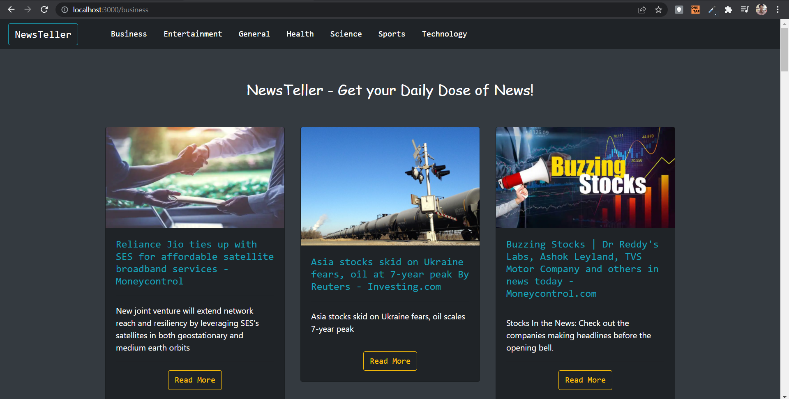

# NewsTeller 📰: A React App

## Tech Stacks 👨‍💻
- HTML
- CSS
- BootStrap
- React JS

---

The NewsTeller Application uses the [NewsAPI](https://newsapi.org/), for fetching the news.

---

## About the Project and Features 🤩
NewsTeller is a news app which can be used to grab quick daily news bites. If you are interested in updating yourself with daily news, NewsTeller is for you!

## Categories Available 🗞️
NewsTeller covers wide variety of categories such as - business, 
- entertainment, 
- general, 
- health, 
- science, 
- sports,
- technology. 

---

---